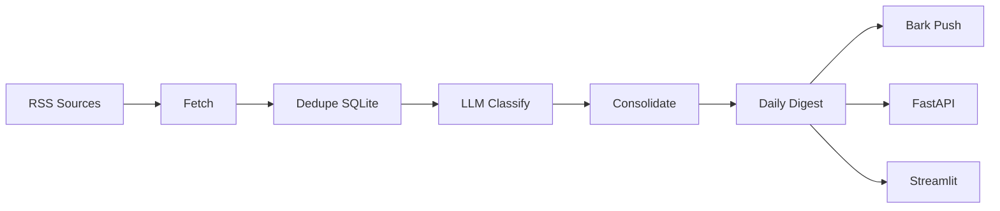

# NewsScraper

**每天自动把 AI / 具身智能资讯，整理成一份中文日报，推送到你的手机。**

RSS 抓取 → LLM 分类摘要 → 智能去重整合 → Bark 推送 / API / Web 阅读。  
无需手动刷 Twitter、HN、TechCrunch，早上打开手机就能看到精选资讯。

[English](#english) · [快速开始](#快速开始) · [开发者文档](README.dev.md)

---

## 你能得到什么

| 能力 | 说明 |
|------|------|
| **每日自动抓取** | 聚合 TechCrunch、VentureBeat、HN、OpenAI Blog 等 RSS 源 |
| **商业 / 科技分类** | 融资 IPO、并购估值 vs 新模型、Agent、开源、Benchmark |
| **中文整合摘要** | 去重、过滤噪声，商业 5 条 + 科技 8 条精编推送 |
| **手机 Bark 推送** | iPhone 直接看正文，历史可回看 |
| **多端消费** | FastAPI（7800）+ Streamlit Web + iOS 骨架 |

---

## 工作原理



---

## 快速开始

### 环境要求

- Python 3.10+
- 一个 LLM API Key（Qwen / Claude / 任意 OpenAI 兼容接口）
- iPhone + [Bark](https://apps.apple.com/app/bark-customed-notifications/id1403753865)（可选，用于推送）

### 1. 克隆并安装

```bash
git clone https://github.com/mobiusstrip1/NewsScraper.git
cd NewsScraper

# macOS / Linux
chmod +x scripts/*.sh && ./scripts/setup_venv.sh
source .venv/bin/activate

# Windows
scripts\setup_venv.bat
.venv\Scripts\activate.bat

cp .env.example .env   # Windows: copy .env.example .env
```

### 2. 填写配置

编辑 `.env`，至少配置：

```env
OPENAI_API_KEY=your-api-key
OPENAI_BASE_URL=https://dashscope.aliyuncs.com/compatible-mode/v1
OPENAI_MODEL=qwen-flash

BARK_KEY=your-bark-key
```

> Bark Key 在 App **首页**复制，不是 Settings 里的 Device Token。  
> 完整配置项见 [.env.example](.env.example)。

### 3. 运行

```bash
# 测试 Bark 推送
python src/notify.py --verbose

# 跑完整链路（抓取 → 分类 → 整合 → 推送）
python src/main.py
```

成功后你会在手机上收到 `今日AI资讯（商业X·科技Y）`，本地生成 `digest/YYYY-MM-DD.md`。

### 4. 设置每日定时（可选）

```bash
# macOS
./scripts/install_schedule_mac.sh

# Windows
scripts\install_schedule_win.bat
```

默认每天 **08:00** 自动运行。

---

## 推送效果示例

```text
【商业】共4条
★★★★ Mercor 洽谈 200 亿美元估值 - AI 招聘平台新一轮融资谈判中 - TechCrunch
...

【科技】共8条
★★★★★ OpenAI 发布新一代语音模型 - 支持更自然的实时对话 - TechCrunch AI
★★★★ Google 发布 SensorFM 可穿戴基础模型 - 统一健康数据接口 - Hacker News
...
```

完整原始列表保存在 `digest/YYYY-MM-DD-raw.md`，推送版为精编整合结果。

---

## 资讯筛选策略

**商业类（投资向）**  
融资、并购、IPO/上市、估值变动、财报、政策监管  
重点关注：OpenAI、Anthropic、Google、Meta、半导体资本动态等

**科技类（技术向）**  
新模型发布、Benchmark 跑分、Agent 框架、开源权重、具身智能/机器人进展

**自动过滤**  
Show HN 小工具、无关社会新闻、重复报道、低价值营销稿

可在 `.env` 调整数量：

```env
DIGEST_MAX_BUSINESS=5
DIGEST_MAX_TECH=8
```

---

## 扩展能力

### API 服务（端口 7800）

```bash
./scripts/start_api.sh        # macOS
scripts\start_api.bat         # Windows
```

| 接口 | 说明 |
|------|------|
| `GET /digest/today` | 今日摘要 |
| `GET /digest/{date}` | 指定日期 |
| `GET /digest?category=科技&days=7` | 按分类筛选 |

文档：`http://127.0.0.1:7800/docs`

### Web 阅读（端口 8502）

```bash
./scripts/start_web.sh
# 浏览器打开 http://127.0.0.1:8502
```

### iOS 客户端

`ios/AI News Digest/` 提供 SwiftUI 最小骨架（今日 / 详情 / 历史），可接 API 二次开发。

---

## 模型支持

通过 `.env` 切换，无需改代码：

| 配置 | 说明 |
|------|------|
| `LLM_PROVIDER=auto` | 有 OpenAI Key 走兼容接口，否则走 Claude |
| `OPENAI_MODEL=qwen-flash` | 推荐 flash 模型，速度快、成本低 |
| `OPENAI_MODEL_CLASSIFY` | 分类专用模型（可选） |
| `LLM_CLASSIFY_WORKERS=3` | 并行分类，加速处理 |
| `LLM_ENABLE_POLISH=false` | 跳过中文润色，进一步提速 |

也支持 Anthropic Claude，见 [.env.example](.env.example)。

---

## 项目结构

```
NewsScraper/
├── config/sources.yaml    # RSS 源列表
├── src/
│   ├── main.py            # 主流程入口
│   ├── fetch.py           # RSS 抓取
│   ├── classify.py        # LLM 分类
│   ├── consolidate.py     # 整合去重
│   ├── notify.py          # Bark 推送
│   └── api.py             # FastAPI
├── scripts/               # 跨平台运行脚本
├── web/app.py             # Streamlit 前端
└── ios/                   # SwiftUI 骨架
```

---

## 常见问题

<details>
<summary><b>Bark 显示 sent 但手机没收到？</b></summary>

1. 确认填的是 Bark **首页 Key**，不是 Device Token  
2. 检查 `.env` 里是否有多行 `BARK_KEY=`（后面的空行会覆盖前面的有效 Key）  
3. 运行 `python src/notify.py --verbose`，确认返回 `code: 200`
</details>

<details>
<summary><b>运行很慢或 LLM 超时？</b></summary>

换 `qwen-flash` 模型，并设置：

```env
LLM_TIMEOUT_POLISH=300
LLM_CLASSIFY_WORKERS=3
```

若仍超时，设 `LLM_ENABLE_POLISH=false` 跳过润色步骤。
</details>

<details>
<summary><b>商业资讯太少？</b></summary>

在 `config/sources.yaml` 增加商业向 RSS 源，或调低 `DIGEST_MIN_IMPORTANCE`。  
中文商业源（36氪、机器之心等）计划通过自建 RSSHub 接入。
</details>

---

## Roadmap

- [ ] 中文源接入（RSSHub 自建实例）
- [ ] 用户反馈「不感兴趣」→ 个性化过滤
- [ ] 同一事件多源聚合为一条
- [ ] Docker 一键部署

---

## 贡献

欢迎 Issue 和 PR：

- 补充高质量 RSS 源
- 改进分类 / 整合 prompt
- 完善 iOS / Web 体验

详细开发指南见 [README.dev.md](README.dev.md)。

---

## License

待补充开源协议。如需用于商业场景，请先通过 Issue 联系作者。

---

## English

**NewsScraper** aggregates AI / robotics / embodied intelligence news from RSS feeds, classifies and summarizes them with LLM, and delivers a curated daily digest to your iPhone via [Bark](https://github.com/Finb/Bark).

**Quick start:** clone → `pip install -r requirements.txt` → copy `.env.example` to `.env` → `python src/main.py`

For full setup, scheduling, API, and troubleshooting, see [README.dev.md](README.dev.md).
